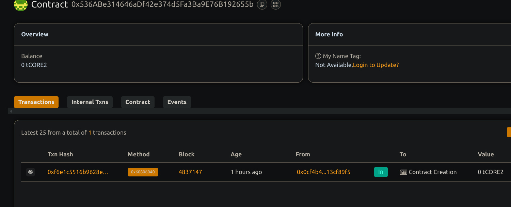

# Token Vesting Contract for Team Allocations

## 📖 Project Description

This smart contract manages vesting schedules for ERC-20 token allocations to team members. It ensures tokens are released gradually over time based on a cliff and vesting duration.

## 🌍 Project Vision

To automate and secure token distribution for core teams, increasing transparency and enforcing long-term incentives.

## 🔑 Key Features

- Owner-only function to create vesting schedules
- Configurable start, cliff, and duration
- Claim function for beneficiaries to collect vested tokens
- Prevents premature claims and over-allocation

## 🚀 Future Scope

- Batch creation of schedules
- Revoke or pause schedules
- On-chain UI dashboard for tracking vesting progress
- DAO-based schedule control and visibility

## Contract details
0x536ABe314646aDf42e374d5Fa3Ba9E76B192655b